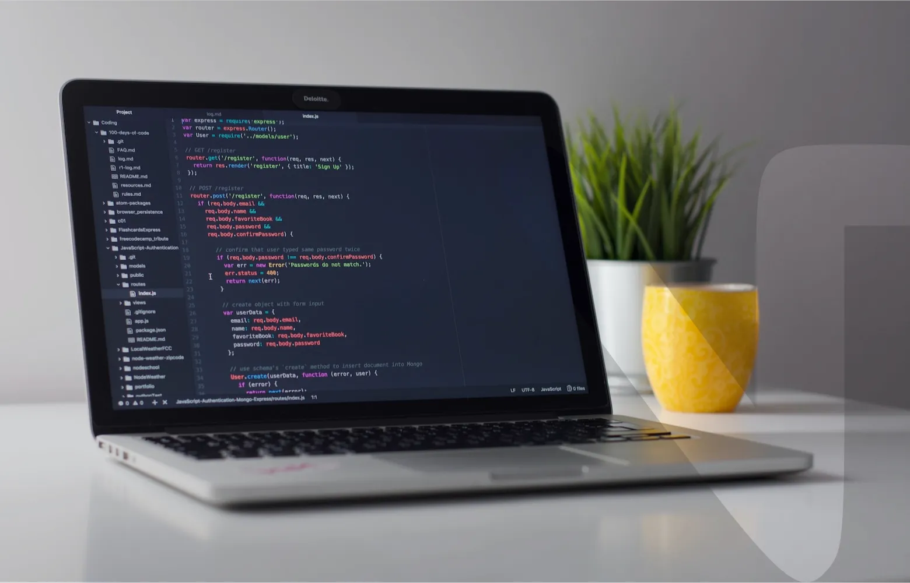

<!--
**kathirr007/kathirr007** is a ✨ _special_ ✨ repository because its `README.md` (this file) appears on your GitHub profile.

Here are some ideas to get you started:

- 🔭 I’m currently working on ...
- 🌱 I’m currently learning ...
- 👯 I’m looking to collaborate on ...
- 🤔 I’m looking for help with ...
- 💬 Ask me about ...
- 📫 How to reach me: ...
- 😄 Pronouns: ...
- ⚡ Fun fact: ...
-->

<h1 align="center">Hi there👋, I'm Kathiravan</h1>
<h3 align="center">Sr. Fullstack Developer at Mudrantar, Hyderabad.</h3>

- 🔭 I’m currently focusing on **Getting to know how to use ChatGPT, Gemini and other availabe AI LLM for my day to day Developments**

<!-- - 🌱 I’m currently learning **Blockchain** -->

- 👨‍💻 Know more about me [https://kathirr007.vercel.app/](https://kathirr007.vercel.app/)

- 💬 Ask me about **HTML/CSS, LESS, SASS, Javascript, Vue.js, Nuxt.js, Vite.js, Gulp.js, Node.js, Git/Github etc.,**

- 📫 How to reach me Email: **kathirr007@gmail.com** Mobile: **<a href="tel:+918553340791">+918553340791</a>**

- 📄 Know about my experiences [https://kathirr007.vercel.app/Kathiravan+K+Resume_UI_Updated.pdf](https://kathirr007.vercel.app/Kathiravan+K+Resume_UI_Updated.pdf)

<h3 align="left">Connect with me:</h3>

<h3 align="left">Languages and Tools:</h3>

                              

&nbsp;

